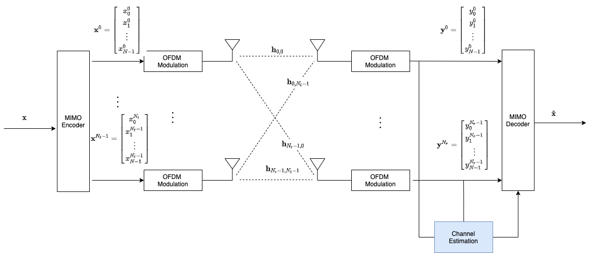
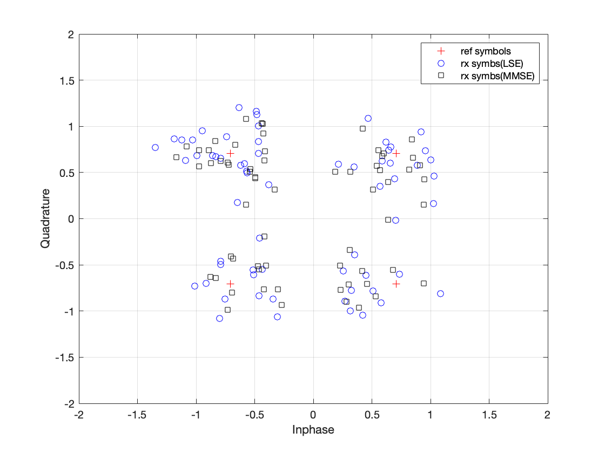

# MIMO-OFDM-Channel-Estimation
Channel Estimation for MIMO OFDM Systems (LSE&amp; MMSE)



try out `example_run.m` to start

```matlab
function [h_hat,H_hat] = mimoOfdmChannelEst(rxSymbs,pilots,pilotPos,Nt,Nr,nFFT,nTaps,N0,estMethods)
% estimate channels in MIMO-OFDM systems(LSE/MMSE)
% rxSymbs - received symbols a  nFFT X Nr vector
% pilots - pilot symbols, a nP X 1 vector, nP isnumber of pilots
% pilotPos - positions of pilots a nP X 1 vector, 
% Nt -  number of transmit antennas
% Nr - number of receive antennas
% nFFT - fft size
% nTaps - the number of taps of the channel
% N0 -  noise variance
% estMethods: 'LSE' or 'MSE'
% h_hat -  estimated channel impulse response
% H_hat - estimated channel frequency response`
```

[ref] I. Barhumi, G. Leus and M. Moonen, 
"Optimal training design for MIMO OFDM systems in mobile wireless channels," 
 in IEEE Transactions on Signal Processing, vol. 51, no. 6, pp. 1615-1624,
June 2003.

